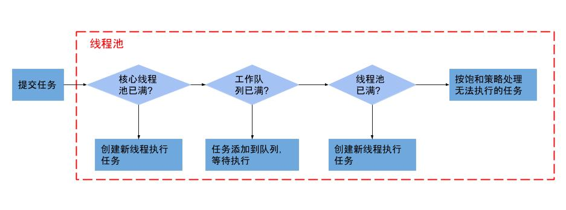

# 线程池

> 线程池的工作主要是控制运行的线程数量，处理过程中将任务放入队列，然后在线程创建后启动这些任务，如果线程数量超过了最大数量，超出数量的线程排队等候，等其他线程执行完毕，再从队列中取出任务来执行。

# 1. 优势
第一：降低资源消耗，通过重复利用已创建的线程降低线程创建和销毁造成的消耗。

第二：提高响应速度，当任务到达时，任务可以不需要等待线程创建就能立即执行。

第三：提高线程的可管理性。线程是稀缺资源，如果无限制的创建，不仅会消耗系统资源，还会降低系统的稳定性，使用线程池可以进行统一的分配，调优和监控。

>它的主要特点为：线程复用，控制最大并发数，管理线程。

# 2. 线程池七大参数
```java
public ThreadPoolExecutor(int corePoolSize,
                              int maximumPoolSize,
                              long keepAliveTime,
                              TimeUnit unit,
                              BlockingQueue<Runnable> workQueue) {
        this(corePoolSize, maximumPoolSize, keepAliveTime, unit, workQueue,
             Executors.defaultThreadFactory(), defaultHandler);
    }
```
-  int corePoolSize：

　   核心工作线程数，线程池启动创建的线程数。

- int maximumPoolSize：

　   最大线程数（值必须大于等于1），平时只有核心数个线程在执行，如果任务特别多，任务队列满了之后，就会出创建临时线程。能够创建多少个临时线程呢？临时线程数＝最大线程数－核心工作线程数

- long keepAliveTime：

　   临时线程空闲最大的存活时间，当前池中线程数量超过corePoolSize时，当空闲时间达到keepAliveTime时，多余线程会被销毁直到只剩下corePoolSize个线程为止
　
- TimeUnit unit：

　   存活时间单位。

- BlockingQueue workQueue：

　   任务队列，被提交但尚未被执行的任务，当任务数超过核心工作线程数之后用于存储任务的队列。任务队列也有分：
```
(1) 有界队列：
只能存储指定数量个任务进队列中。

(2) 无界队列：
可以无限将任务存储进队列中，只要硬件条件允许。

(3) 阻塞队列：
同一个时刻只能一个一个任务入队列，是有序的，是线程安全的。
```

- ThreadFactory threadFactory：

　线程创建工厂，一般我们使用默认的Executors.defaultThreadFactory()。

- RejectedExecutionHandler handler：

　拒绝策略，当任务数超过最大线程数之后，并且任务队列也存储满了，如果还有任务到来，任务就无法处理。拒绝策略就是为了解决这种问题而产生的。
　
默认提供了四种拒绝策略。默认使用的是AbortPolicy，也可以自己自定义拒绝策略。例如：如果任务队列满了，可以记录到日志中，然后在进行重新入队操作。

```
(1)AbortPolicy：
丢弃任务并抛出RejectedExecutionException异常。
　
(2)DiscardPolicy：
如果任务队列满了，直接丢弃任务，也不抛出异常。
　
(3)CallerRunsPolicy：
由提交任务到线程池的那个线程来处理该任务。
　
(4)DiscardOldestPolicy：
丢弃任务队列中最前面的任务，并且将当前提交的任务存入任务队列中。

```

# 3. 线程池流程


线程池启动，初始化线程池。线程池通过线程工厂创建核心线程。当任务过来之后，先将任务交给核心线程执行；如果核心线程还有，则当任务来了之后，直接创建核心线程并且将任务交给核心线程处理。如果没有足够的核心线程，就将任务存入任务队列中，如果任务队列满了，则创建临时线程，然后将任务交给临时线程处理。如果临时线程数+核心线程数创建的数量等于最大线程数；并且任务队列也满了，则会执行拒绝策略。

# 4.java中提供的线程池


## 4.1 newFixedThreadPool
执行长期任务性能好，创建一个线程池，一池有N个固定的线程，有固定线程数的线程
```java
public class MyThreadPoolDemo {

    public static void main(String[] args) {

        ExecutorService threadPool = Executors.newFixedThreadPool(5);

        try {
            // 模拟有10个顾客来银行办理业务，目前池子里面有5个工作人员提供服务
            for (int i = 1; i <= 10; i++) {
                threadPool.execute(() -> {
                    System.out.println(Thread.currentThread().getName() + "\t办理业务");
                });
            }
        } catch (Exception e) {
            e.printStackTrace();
        } finally {
            threadPool.shutdown();
        }

    }
}
```

## 4.2 newSingleThreadExecutor
一个任务一个任务的执行，一池一线程
```java
public class MyThreadPoolDemo {

    public static void main(String[] args) {

        ExecutorService threadPool = Executors.newSingleThreadExecutor();

        try {
            // 模拟有10个顾客来银行办理业务，目前池子里面有1个工作人员提供服务
            for (int i = 1; i <= 10; i++) {
                threadPool.execute(() -> {
                    System.out.println(Thread.currentThread().getName() + "\t办理业务");
                });
            }
        } catch (Exception e) {
            e.printStackTrace();
        } finally {
            threadPool.shutdown();
        }

    }
}
```

## 4.3 newCachedThreadPool
执行很多短期异步任务，线程池根据需要创建新线程，
但再先前构建的线程可用时将重用它们。可扩容，遇强则强
一个任务一个任务的执行，一池一线程
```java
public class MyThreadPoolDemo {

    public static void main(String[] args) {

        ExecutorService threadPool = Executors.newCachedThreadPool();

        try {
            // 模拟有10个顾客来银行办理业务，目前池子里面有N个工作人员提供服务
            for (int i = 1; i <= 10; i++) {
                threadPool.execute(() -> {
                    System.out.println(Thread.currentThread().getName() + "\t办理业务");
                });
            }
        } catch (Exception e) {
            e.printStackTrace();
        } finally {
            threadPool.shutdown();
        }

    }
}
```

## 4.3 newScheduledThreadPool
创建一个可定期或者延时执行任务的定长线程池，支持定时及周期性任务执行
```java
public class MyThreadPoolDemo {

    public static void main(String[] args) {

        ScheduledExecutorService scheduledThreadPool = Executors.newScheduledThreadPool(3);

        try {
            // 延迟1秒钟后每隔3秒执行一次任务
            for (int i = 1; i <= 10; i++) {
                scheduledThreadPool.scheduleAtFixedRate(() -> {
                    System.out.println(Thread.currentThread().getName() + "\t办理业务");
                }, 1, 3, TimeUnit.SECONDS);
            }
        } catch (Exception e) {
            e.printStackTrace();
        } finally {
            scheduledThreadPool.shutdown();
        }

    }
}
```

# 5.ThreadPoolExecutor创建线程池


```java
public static void main(String[] args) {

        ExecutorService threadPool = new ThreadPoolExecutor(
                2,
                5,
                2L,
                TimeUnit.SECONDS,
                new LinkedBlockingQueue<>(3),
                Executors.defaultThreadFactory(),
                new ThreadPoolExecutor.AbortPolicy());

        try {
            // 最大容纳数=最大线程数+队列数(8=5+3)
            for (int i = 1; i <= 9; i++) {
                threadPool.execute(() -> {
                    System.out.println(Thread.currentThread().getName() + "\t办理业务");
                });

            }
        } catch (Exception e) {
            e.printStackTrace();
        } finally {
            threadPool.shutdown();
        }
    }
```

# 6.修改最大线程数
查看CPU核数
```java
// CPU核数
System.out.println(Runtime.getRuntime().availableProcessors());
```
## 6.1 CPU密集型
CPU密集的意思是该任务需要大量的运算，而没有阻塞，CPU一直全速运行。

CPU密集任务只有在真正的多核CPU上才可能得到加速（通过多线程），而在单核CPU上，无论你开几个模拟的多线程该任务都不可能得到加速，因为CPU总的运算能力就那些。
CPU密集型任务配置尽可能少的线程数量：

CPU密集型 = 比CPU核数多1~2

## 6.2 IO密集型
IO包括：数据库交互，文件上传下载，网络传输等

（1）方法一：
由于IO密集型任务线程并不是一直在执行任务，则应配置尽可能多的线程，如CPU核数*2

（2）方法二：
IO密集型，即该任务需要大量的IO，即大量的阻塞。
在单线程上运IO密集型的任务会导致浪费大量的CPU运算能力浪费在等待。
所以在IO密集型任务中使用多线程可以大大的加速程序运行，即使在单核CPU上，这种加速主要就是利用了被浪费掉的阻塞时间。
IO密集型时，大部分线程都阻塞，故需要多配置线程数：

参考公式：CPU核数 /（1 - 阻系数）
比如8核CPU：8/(1 - 0．9)=80个线程数
阻塞系数在0.8~0.9之间
